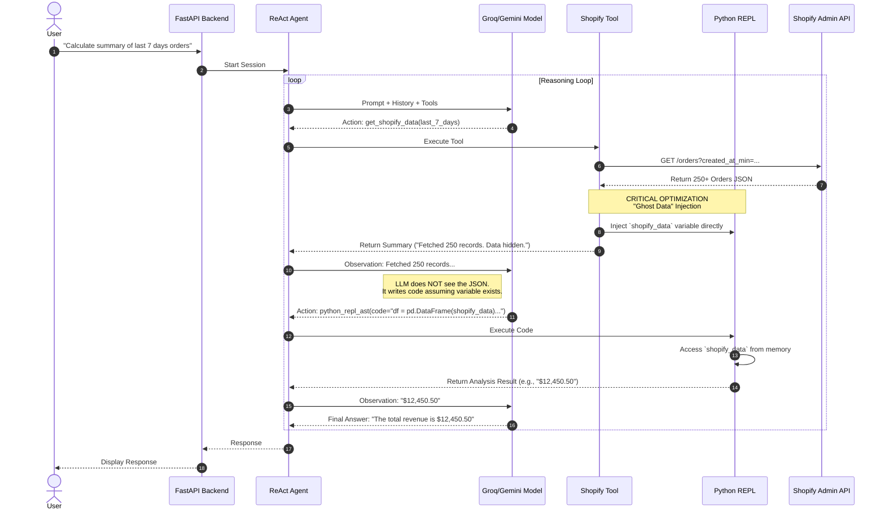

# System Architecture & Workflows 📊

This specific document details the internal flows of the ShopifyAI Agent, highlighting the "Ghost Data" optimization pattern.

## 1. The "Ghost Data" Analysis Pipeline (Sequence)
This diagram illustrates the critical optimization where large datasets are injected directly into the Python REPL's memory, bypassing the LLM's token limit.



## 2. Component Architecture (System)
How the modules interact within the Monorepo.

```mermaid
graph TD
    subgraph Frontend
        UI[React UI]
        Ch[Chat Component]
    end

    subgraph Backend
        API[FastAPI Router]
        DB[(SQLite Session DB)]
        
        subgraph "Agent Service"
            Mgr[Agent Manager]
            Mem[Memory/History]
            
            subgraph "Tools"
                T1[Shopify Tool]
                T2[Python REPL]
            end
            
            Inj[Variable Injector]
        end
    end
    
    subgraph External
        L[LLM (Groq/Gemini)]
        S[Shopify Store]
    end

    UI --> API
    API --> Mgr
    Mgr <--> DB
    Mgr <--> L
    Mgr --> T1
    Mgr --> T2
    
    T1 <--> S
    T1 --> Inj
    Inj -.->|Injects Data Context| T2
```
