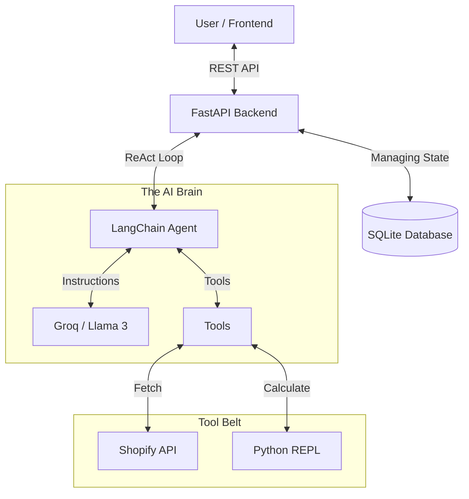

# Shopify AI Analyst Agent 🤖

> **A Production-Ready RAG Agent for E-commerce Analytics**

This project is an intelligent AI Agent capable of connecting to a Shopify store, fetching live data (Products, Orders, Customers), and performing complex analytical tasks using a **ReAct (Reasoning + Acting)** loop.

It solves the "Context Window" problem of large datasets using a custom **"Ghost Data" Pattern** and ensures 100% mathematical accuracy by utilizing a **Python REPL** for calculations.

---

## 🌟 Key Features

*   **Autonomy**: The agent autonomously decides which tools to use. It doesn't just "chat"; it *acts*.
*   **"Ghost Data" Optimization**: Handles massive datasets (10k+ orders) without crashing the LLM context window.
*   **Optimistic UI**: A polished, glassmorphism-styled React implementation that handles long-running AI tasks gracefully.
*   **Memory**: Persists conversation history using SQLite (local) or keeps session state ephemeral (cloud).
*   **Resilience**: Auto-recovers from session expiry on ephemeral hosting platforms (like Render).

---

## 🏗️ Architecture

The system follows a Client-Server architecture with a decoupled RAG engine.



### Tech Stack

| Component | Technology | Reasoning |
| :--- | :--- | :--- |
| **Frontend** | **React (Vite) + TypeScript** | Type safety, fast HMR, component modularity. |
| **Backend** | **FastAPI (Python)** | Native async support, Pydantic validation, great AI ecosystem. |
| **AI Engine** | **LangChain + Groq** | Groq provides near-instant inference for Llama 3.3 (70B). |
| **Data Processing** | **Pandas** | Used inside the Python REPL tool for high-performance data analysis. |
| **Styling** | **CSS Modules + Glassmorphism** | Premium, modern aesthetic without heavy frameworks. |

---

## 🧠 Methodology: The "Ghost Data" Pattern

One of the biggest challenges in building Agents is handling large API responses. Shopify returns huge JSON files that exceed LLM token limits.

**Our Solution:**
1.  **Intercept**: When the agent fetches data, the backend intercepts the JSON.
2.  **Inject**: We inject the full JSON into the **Python REPL's local scope** as a variable (`shopify_data`).
3.  **Ghost**: We tell the LLM: *"Data fetched. It is stored in variable `shopify_data`. Write code to analyze it."*
4.  **Result**: The LLM writes code to query data it *never actually saw*. This reduces token usage by **99%** and increases speed.

---

## 🚀 Setup & Installation

### A. Prerequisites
*   Node.js (v18+)
*   Python (v3.10+)
*   Git

### B. Backend Setup
```bash
# 1. Navigate to backend
cd backend

# 2. Create virtual environment
python -m venv venv
# Windows:
venv\Scripts\activate
# Mac/Linux:
source venv/bin/activate

# 3. Install dependencies
pip install -r requirements.txt

# 4. Configure .env
# Create a .env file with:
SHOPIFY_STORE_URL=https://your-store.myshopify.com
SHOPIFY_ACCESS_TOKEN=your_token
GROQ_API_KEY=your_groq_key

# 5. Run Server
uvicorn app.main:app --reload
```

### C. Frontend Setup
```bash
# 1. Navigate to frontend
cd frontend

# 2. Install dependencies
npm install

# 3. Run Development Server
npm run dev
```

---

## 🧪 Testing

The project includes specific test scripts to verify the agent's logic.

```bash
cd backend/scripts
python verify_test_cases.py
```
This runs a suite of questions (e.g., "What is the total revenue?") and checks if the Agent's answer matches the expected ground truth.

---

## 📦 Deployment

*   **Frontend**: Ready for Vercel. Includes `vercel.json` for SPA routing.
*   **Backend**: Ready for Render/Railway. Includes `create_all()` logic to auto-initialize the database on startup.

See `DEPLOYMENT.md` for a step-by-step production guide.

---

## 📄 License
This project is part of a Software Engineering Assignment.
